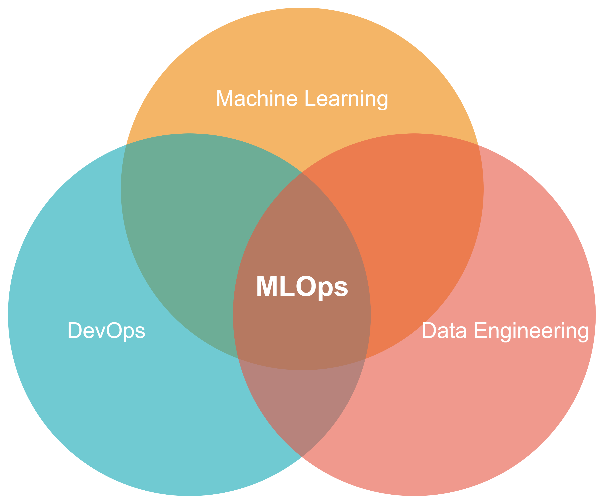
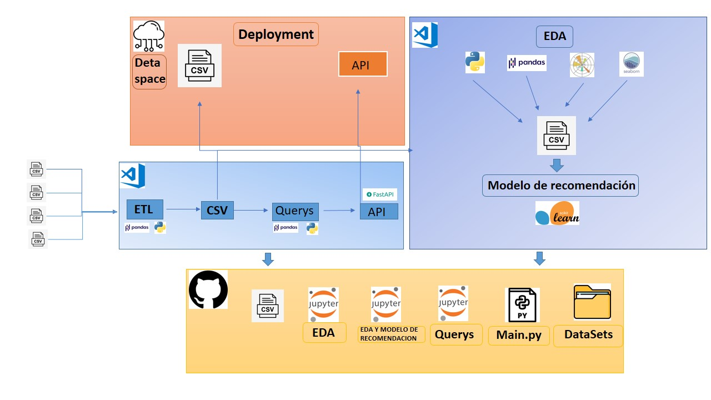

<h1 align=center> HENRY’S LABS </h1>

<h2 align=center>PROYECTO INDIVIDUAL I -- ML_OPS  
    _Ingeniero y Data Scientist: Martín Mariano, Giribone_</h2>

> Encontraran información sobre el trabajo de ETL, la API que se me solicito hacer, el EDA y el modelo de recomendación.

## Arquitectura del proyecto

## Rol a desarrollar

Empezaste a trabajar como Data Scientist en una start-up que provee servicios de agregación de plataformas de streaming. El mundo es bello y vas a crear tu primer modelo de ML que soluciona un problema de negocio: un sistema de recomendación que aún no ha sido puesto en marcha!

Vas a sus datos y te das cuenta que la madurez de los mismos es poca (ok, es nula 😭): Datos sin transformar, no hay procesos automatizados para la actualización de nuevas películas o series, entre otras cosas…. haciendo tu trabajo imposible 😩.

Debes empezar desde 0, haciendo un trabajo rápido de Data Engineer y tener un MVP (Minimum Viable Product) para la próxima semana! Tu cabeza va a explotar 🤯, pero al menos sabes cual es, conceptualmente, el camino que debes de seguir ❗. Así que te espantas los miedos y te pones manos a la obra 💪

:red_circle: **INICIO** :red_circle:

* **Datasets**: _Bases de datos recibidas_
* **detaAPI**: _Dentro encontraran un archivo main.py que contiene todo el codigo de la API. Requierements.txt que contiene las dependencias necesarias para que funcione y el csv utilizado para realizar todas las consultas_
* **Trasformacion de datos**:  _Paso a paso detallado del proceso de ETL_
* **Purebas_1**: _Cuaderno con las pruebas para las consultas pedidas_
* **Analisis_exploratorio_de_datos**: _Paso a paso del proceso de EDA y el modelo de recomendación_
* **Modelo_de_recomendación**: _Paso a paso del deserrollo del modelo de recomendación

:red_circle: **Funciones de la API:** :red_circle::

* Película con mayor duración con filtros opcionales de AÑO, PLATAFORMA Y TIPO DE DURACIÓN.
* Cantidad de películas por plataforma con un puntaje mayor a XX en determinado año
* Cantidad de películas por plataforma con filtro de PLATAFORMA
* Actor que más se repite según plataforma y año.

**Para el deployment de la API, utilice Deta Space, me podran encontrar como: 'martingiribone' y el nombre de la aplicación: 'detaAPI'**

Te espero ahí :D

https://deta.space/discovery/r/thewhxdah4gvgru1

:warning: **Algunas aclaraciones sobre las consultas** :warning:

* :heavy_exclamation_mark: Tiene que estar todo escrito  en minuscula.

* :white_check_mark: Amazon, Netflix, Hulu y Disney son las plataformas que acepta.

* :heavy_exclamation_mark: Tiene que instalar la aplicación.

* :x: No utilize caracteres hispanos.

:link: **Aca encontrara los links a las consultas**

:small_blue_diamond: https://detaapi-1-h9040310.deta.app/docs#/default/get_max_duration_get_max_duratio__year___platform___duration_type__get

:small_blue_diamond: https://detaapi-1-h9040310.deta.app/docs#/default/get_score_count_get_score_count__platform___scored___release_year__get

:small_blue_diamond: https://detaapi-1-h9040310.deta.app/docs#/default/get_count_platform_get_count_platform__platform__get

:small_blue_diamond: https://detaapi-1-h9040310.deta.app/docs#/default/get_actor_get_actor__platform___year__get

 ### **Herramientas utilizadas**

:small_orange_diamond: **[Python](https://www.python.org/)**: Lenguaje de programación, aplicado a lo ancho y largo del proyecto.

:small_orange_diamond: **[Pandas](https://pandas.pydata.org/)** : Pandas es una libreria escrita para el lenguaje Python para la manipulación y el análisis de datos.

:small_orange_diamond: **[Matplotlib](https://matplotlib.org/)**: Matplotlib es una libreria en Python  para crear visualizaciones de nuestros datos.

:small_orange_diamond: **[Seaborn](https://seaborn.pydata.org/)**: Seaborn es una libreria de visualización de datos de Python basada en matplotlib.

:small_orange_diamond: **[Scikit-learn](https://scikit-learn.org/stable/)**: Scikir-learn es una libreria basada en Python para crear modelos de apredinzaje libre como machine learning y deep learning.

:small_orange_diamond: **[FastAPI](https://fastapi.tiangolo.com/)** : Framework para la construcción de la API en Python

:small_orange_diamond: **[Uvicorn](https://www.uvicorn.org/)** : Permite controlar el funcionamiento de la API de manera local.

:small_orange_diamond: **[Deta](https://deta.space/)**
: plataforma online y gratuita, que nos permite realizar el deployment de nuestra API.

:small_orange_diamond: **[Gradio](https://gradio.app/)**: Gradio nos sirve para darle una interfaz al modelo de recomendación para que cualquiera pueda usarlo, en cualquier lugar.

:small_orange_diamond: **[Hagginface](https://huggingface.co/)**: Hagginface desarrolla herramientas para crear aplicaciones utilizando el aprendizaje automático.

**Modelo de recomendacion**

¿Es sabado a la noche, sus amigos salieron pero usted prefiere quedarse en casa viendo una pelicula o serie?

Este modelo de recomendación es para Usted!!! 

:link: https://huggingface.co/spaces/TheMith/MachineLearning_recomendacion 

:warning: **el numero de pelicula tiene que ser la letra 'n', 'a', 'd' , 'h' + 's' + un numero** :warning:

**[Video](https://youtu.be/6z1hTmLK1cg)** : Realice un video mostrando la API, sus consultas, como funciona el sistema de recomedación y mostrando el repositorio. 

:red_circle: **AGRADECIMIENTOS** :red_circle:

Me gustaría agradecer a los menteros y la gente detras de toda la parte de HenryLabs, también a mis compañeros de cohorte que me han acompañado en todo este camino y estamos muy cerca de poder finalizarlo.

### Contacto
* GitHub: https://github.com/MartinGiribonee
* Mail: martingiribone27@gmail.com
